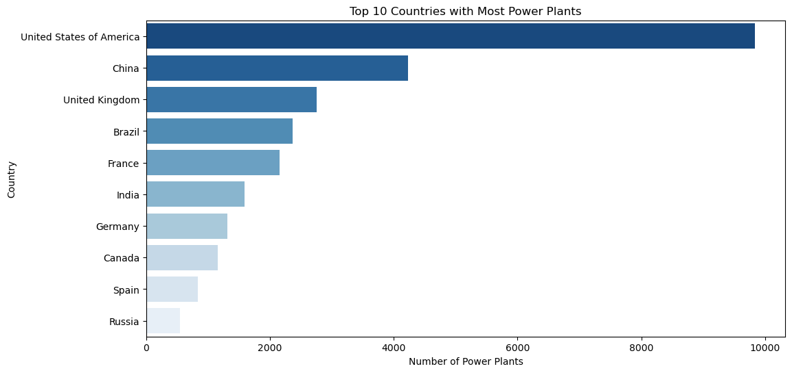
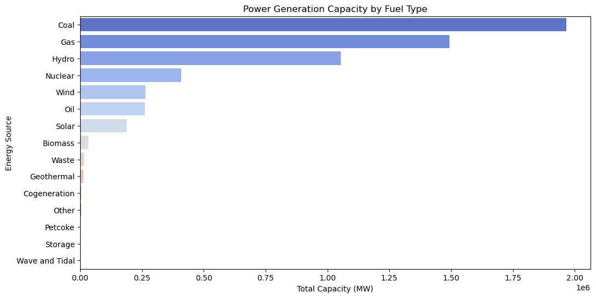
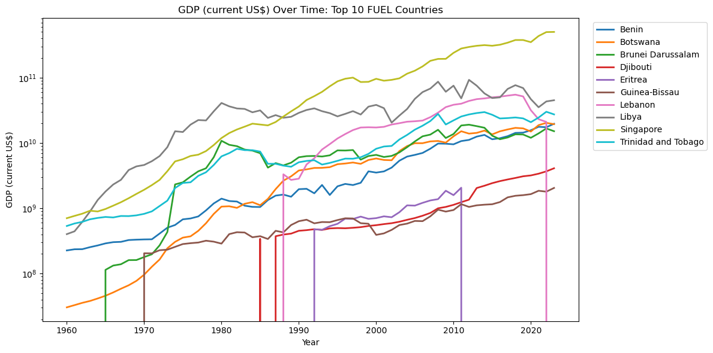
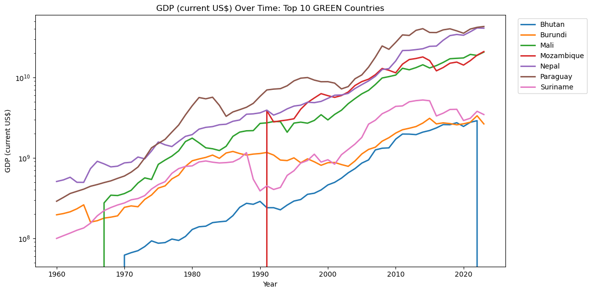
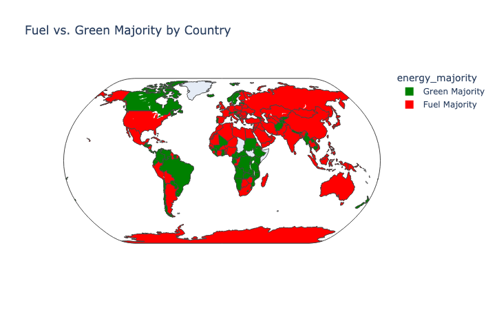
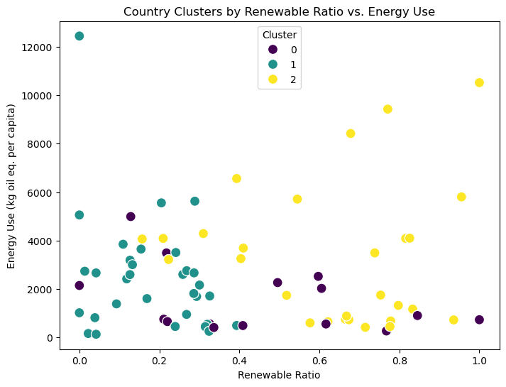
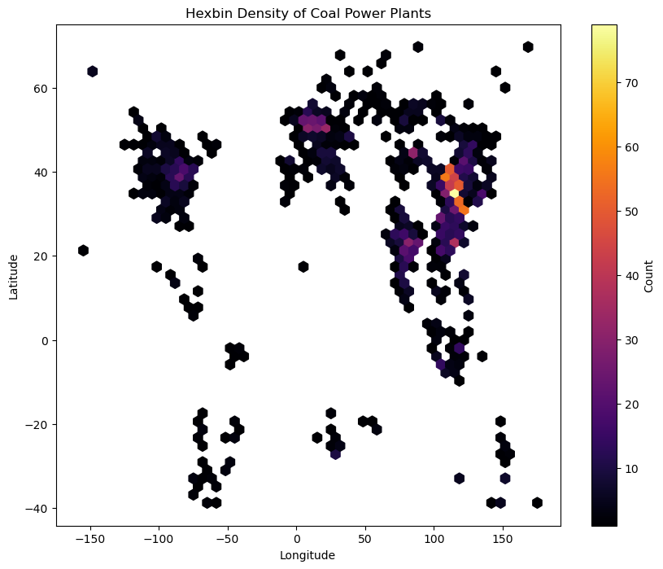

# GlobalPlantsDataset

This repository focuses on analyzing and visualizing global power plant data, along with relevant socio-economic and policy factors that influence the energy landscape.

---

## Week 2 Progress

### Literature Review
- **Created and uploaded** a Literature Review that explores *multi-country* research on energy consumption, emissions, and economic trends.
- Emphasized how **policy instruments** (e.g., carbon pricing, renewable incentives) shape national-level energy outcomes across various countries.
- Highlighted **key methodologies** such as panel data approaches, co-integration, and difference-in-differences for policy impact evaluation.

### Data Alignment
- **Refined dataset selection** to integrate:
  1. IEA time-series data  
  2. World Bank’s World Development Indicators (WDI)  
  3. The Global Power Plant Database
- **Outlined steps** to incorporate both *quantitative* (e.g., subsidy levels) and *qualitative* (e.g., policy start dates) information into the analysis.

Stay tuned for **data cleaning**, **exploratory analysis**, and initial **modeling** phases, building on insights from the literature review.

---
## Week 4 Progress

### Overview
This week, I completed the **initial data collection** and **exploratory data analysis (EDA)** steps:
- Merged power plant data with socio-economic indicators (World Bank).
- Calculated total renewables vs. fossil capacities.
- Examined time-series trends for GDP, emissions, and energy use across top countries.

### Key Achievements
- **Cleaned & Merged**: Created a consolidated `country_capacity` table indicating renewable_ratio for ~167 countries.
- **EDA Visualizations**:
  1. **Bar Charts** for top 10 countries by power plant count, plus total capacity by fuel source.
  

         
         
     

  2. **Pie Chart** showing global renewable vs. non-renewable share.
  

         
     

  
  3. **Line Plots** demonstrating GDP trends over time between fuel majority countries and green energy countries.
  

         
         
     

  4. **Choropleth Map**  Indicating “Green Majority” vs. “Fuel Majority” countries.
  

         
     

### Next Steps
- **Enhanced Correlation Analysis**: Investigate relationships between GDP, CO₂, and renewable share with regression or correlation tests.
- **Improve Mapping**: Possibly create an animated map over different years if consistent time-series coverage is found.

### Additional Notes
- **File Sizes**: The final merged dataset remains manageable (~under 100 MB), so it can be stored locally and visualized with Python libraries.
- **Repository**: All `.ipynb` notebooks for EDA and final `.csv` merges are pushed to GitHub for version control.
---

## Weekly Report 5

### Overview
This week, the main objective was to perform a **multi-variable analysis** on the 2005 data, focusing on **“Energy use (kg of oil equivalent per capita)”**. Originally, 2019 yielded no valid rows (all “..”), so the final approach targeted **2005**—which contained 218 non-missing rows in the `world_bank` table. 

### Key Steps & Code

1. **Identify Year with Data**  
   - Queried the `world_bank` table to check how many rows were not “..” for each year.  
   - Discovered that **2005** (among others) had over 200 rows of actual numeric data for “Energy use.”

2. **Ephemeral SQL Merge**  
   - Used a **LEFT JOIN** between `country_capacity` (which includes total_renewable_capacity & total_capacity) and the `world_bank` data for the chosen year (`2005 [YR2005]`).  
   - Created a new column, `renewable_ratio = total_renewable_capacity / total_capacity`.  
   - Excluded columns that were mostly missing (like `pop_2005`) to avoid dropping too many rows.

3. **Correlation & Single-Variable OLS**  
   - After dropping rows with missing data, ran a **Pearson correlation** between `renewable_ratio` and `energy_2005`.  
   - Found a **negative** correlation (\(r \approx -0.2127\), \(p \approx 0.0168\)), suggesting countries with higher renewable share tend to have lower “energy use” in 2005.  
   - A simple OLS regression of `energy_2005 ~ renewable_ratio` showed a **significant negative slope** (\(-2007\)), but a low R² (~0.045), indicating renewable ratio alone explains little of the variation.

4. **Multiple Regression: Adding GDP**  
   - Queried the “GDP (current US$)” for 2005 in the same ephemeral join.  
   - Built a model: `energy_2005 ~ renewable_ratio + gdp_2005`.  
   - The negative coefficient on `renewable_ratio` remained significant (\(p\approx0.02\)), while GDP’s coefficient was not significant (\(p\approx0.16\)).  
   - The model’s R² rose slightly to ~0.06, so including GDP does not drastically improve explanatory power.

5. **Visualization**  
   - A **scatterplot** and **pairplot** confirm a wide spread of data with a slight negative slope for `renewable_ratio` vs. `energy_2005`.  
   - **Partial regression plots** (via `plot_partregress_grid`) illustrate the relationship between `renewable_ratio` and energy use controlling for GDP.

### Interpretations & Observations
- **Statistically Significant** Negative Relationship: Countries with higher renewable ratio still display *somewhat* lower per-capita energy use in 2005, even controlling for GDP.  
- **GDP Not Overwhelmingly Predictive**: The GDP coefficient in the two-variable model was not significant (\(p\approx0.16\)), suggesting GDP alone does not capture major variations in energy use— or potential issues with data alignment or coverage.  
- **Low R²**: Both single-variable and multi-variable R² values remain under ~0.07, highlighting that **many other factors** likely influence energy use (climate, industrial sector mix, region, etc.).

### Next Steps
1. **Add More Controls**: Incorporate further variables (e.g., “Fossil fuel energy consumption,” “Carbon intensity,” or region dummies) to see if the negative effect of renewables persists or becomes stronger.  
2. **Time-Series or Panel Analysis**: Analyze multiple years (1970–2005, for instance) to track whether increasing renewables over time correlates with lowered energy use or emissions.  
3. **Policy Indicators**: If available, incorporate data from `oecd_greengrowth` or other environmental policy metrics to see if policy intensity moderates the relationship.  
4. **Address Data Gaps**: Explore why certain columns (like population) are missing and consider alternative data sources or partial merges.

By systematically adding variables and looking at multiple years/policies, we can build a more robust model and gather deeper insights for the final project.

---
## Midterm Progress:
For my midterm project, I integrated and analyzed global power plant data alongside socioeconomic, emissions, and policy indicators to study energy use and the energy mix across countries. I merged datasets from sources like the Global Power Plant Database, World Bank, IEA, and OECD, and performed comprehensive exploratory data analysis to uncover key trends. Initial simple regressions and advanced panel data models—using both Fixed and Random Effects—revealed important differences between within-country changes and cross-country comparisons. The Hausman test indicated that time-invariant factors play a significant role, guiding my next steps to incorporate CO₂ emissions data and refine the models further. This progress lays a solid foundation for understanding the impact of renewable energy and green policies on emissions and energy use.

---

# Weekly Report 6

**Date:** March 15, 2025  

## 1. Overview

This week’s work focused on extending my analysis with two new approaches:
- **Clustering Analysis:** Using K-Means to group countries based on their renewable capacity ratio, energy use, GDP, and environmental tax data.
- **Geospatial Hotspot Analysis:** Creating a hexbin density map to visualize the geographic concentration of coal power plants.

## 2. Data Integration & Code Execution

- **Country-Level Data Merge:**  
  I merged data from:
  - **Country Capacity:** Total and renewable capacity (from `country_capacity` or computed via `power_plants`).
  - **World Bank:** Energy use and GDP for 2005.
  - **OECD Greengrowth:** Environmental tax indicator using the `ENVTAX` measure.
  
  *Note:* Standardization (lowercasing and stripping) was applied to ensure consistent country naming across datasets.

- **Clustering Analysis:**  
  - Selected key features: `renewable_ratio`, `energy_use`, `gdp`, and `env_tax`.
  - Applied StandardScaler and ran a K-Means clustering (3 clusters as an example).
  - Visualized the clusters using a scatter plot (Renewable Ratio vs. Energy Use).

- **Geospatial Analysis:**  
  - Loaded power plant data into a GeoDataFrame.
  - Filtered for coal power plants (case-insensitive match).
  - Generated a hexbin density map to highlight hotspots of coal plants globally.

- **Diagnostic Check:**  
  The output of available OECD measures (via `SELECT DISTINCT MEASURE FROM oecd_greengrowth`) confirmed that the `ENVTAX` measure is available and was used for the policy analysis.

## 3. Key Outputs & Observations

- **Clustering Output:**  
  - Example rows from the merged data show countries like *Albania*, *Argentina*, and *Australia* with their respective capacity values, energy use, GDP, env_tax, and computed renewable ratios.
  - *Observation:* Some countries (e.g., Albania and Argentina) appear twice with different `env_tax` values, indicating potential duplicates from the OECD dataset that may need further filtering.
           

- **Hexbin Density Map:**  
  - The map visualizes areas with a high concentration of coal power plants.
  - Hotspots are visible in regions known for high coal capacity, providing a spatial complement to my country-level analysis.
             

- **OECD Measures:**  
  - A diagnostic query listed all available measures.
  - The selection of **ENVTAX** aligns with my focus on environmental taxation as a proxy for green growth policies.

## 4. Next Steps

- **Cluster Profiling:**  
  Compute average metrics (renewable ratio, energy use, GDP, env_tax) per cluster to interpret group characteristics.

- **Duplicate Resolution:**  
  Investigate and resolve duplicate entries in the OECD data to ensure each country is uniquely represented.

- **Emissions Data Integration:**  
  Incorporate CO₂ or carbon intensity data to examine the relationship between policy indicators and emissions.

- **Enhanced Spatial Analysis:**  
  Extend the geospatial approach to include other fuel types (e.g., gas, solar, wind) and overlay policy data for richer insights.

## 5. Conclusion

This week’s analyses have added depth to my project by:
- Uncovering natural clusters among countries using unsupervised learning.
- Visualizing the spatial distribution of coal power plants to identify geographic hotspots.
- Confirming data integration across multiple sources, with clear next steps to refine data quality and further link policy with energy outcomes.

These efforts bring us closer to answering my project’s key questions regarding the impact of green growth policies on energy transitions and emissions.

---
# Weekly Report 7

## 1. Overview
This week, I focused on integrating **2015** data from multiple sources:
- **Global Power Plant Database** for capacity (coal, solar, wind, etc.).
- **World Bank** for GDP (current US$) and Energy Use (kg of oil eq. per capita).
- **OECD Green Growth** for an environmental policy/expenditure measure (`EPEA_GDP`).

By aligning everything to 2015, I ensured all datasets had sufficient coverage.

## 2. Data Processing & Merging
1. **OECD Data**: Queried `EPEA_GDP` from `oecd_greengrowth`, grouped duplicates by `(country, year)`, took the median, and filtered for 2015.
2. **World Bank**: Extracted `"2015 [YR2015]"` columns for GDP and Energy Use. 
3. **Capacity Table**: Computed `renewable_ratio = total_renewable_capacity / total_capacity` for each country.
4. **Merging**: Merged on `country` (inner joins for World Bank + capacity, then left join with OECD so that missing countries get `env_policy_2015 = 0`).

## 3. Clustering Analysis
- **Features**: `renewable_ratio`, `energy_use_2015`, `gdp_2015`, `env_policy_2015`.
- **Method**: Standardized features, ran K-Means with `n_clusters=3`.
- **Results**:
  - **Cluster 0**: Mid-level GDP, moderate renewables, moderate energy use, highest environment policy measure.
  - **Cluster 1**: Very high renewables, high energy use, moderate GDP, moderate environment policy.
  - **Cluster 2**: Highest GDP, lower renewables, moderate energy use, lowest environment policy.

These findings suggest different development pathways and policy priorities among the clusters.

## 4. Geospatial Analysis
- Generated **density maps** for coal, solar, and wind power plants using Plotly Express. 
- Observed typical hotspots (e.g., coal in Asia, solar in sun-rich regions, wind in coastal areas).

## 5. Observations
- **Policy Variation**: The `EPEA_GDP` measure provided a non-zero range of values in 2015, enabling a meaningful cluster dimension.
- **Year Choice**: Using 2015 overcame the lack of data in earlier years (e.g., 2005). 
- **Interpretation**: Clusters with higher renewables or higher environment policy scores do not always have the largest GDP or the highest energy consumption—pointing to diverse national contexts.

## 6. Next Steps
1. **Try Other Years**: If other years (2016, 2017) also have matching data, repeat the analysis to see if the clusters change over time.
2. **Expand Variables**: Incorporate CO₂ emissions or additional policy measures to refine the cluster characterization.
3. **Panel Data Approach**: If consistent data is available across multiple years, consider a panel regression or multi-year clustering to capture trends over time.
4. **Improve Visualization**: Add interactivity or overlays on the density maps to compare policy intensity and plant distribution on the same map.

## 7. Conclusion
Aligning the datasets on 2015 allowed for a robust cluster analysis and meaningful policy insights. The geospatial maps highlight fuel-specific hotspots worldwide. Future work will expand the time dimension and explore additional policy or emissions metrics for a more comprehensive picture of global energy transitions.

---

# Weekly Report: 8

## Overview
This week, significant progress was made on our semester-long project that examines the relationship between renewable capacity, CO₂ emissions, and policy measures. We integrated multiple datasets (Global Power Plant DB, World Bank, OECD, and IEA) and developed both cross-sectional and longitudinal analyses to address our research questions.

### Data Preprocessing & Integration
- **Standardized country names** across all datasets (converted to lowercase and trimmed spaces).
- **Merged datasets** using a common "country" field, combining power plant capacity, CO₂ emissions, GDP, and environmental policy (ENVTAX) data.
- **Handled missing values and outliers** by identifying problematic entries (e.g., negative CO₂ readings, extreme capacity figures) and removing them to ensure a clean dataset.

### Single-Year Analysis
- Selected **2014** as the representative year.
- Generated **scatter plots with fitted regression lines** to analyze the relationship between the renewable capacity ratio and CO₂ emissions.
- Applied **K-Means clustering** to group countries based on renewable capacity ratio, GDP, emissions, and policy measures, revealing distinct energy–economy–policy profiles.

## Key Findings
- **Single-Year Analysis:** The relationship between renewable capacity and CO₂ emissions is weak when viewed in isolation, indicating that renewable capacity alone does not guarantee lower emissions.

## Next Steps
-  Time-Series (Panel) Analysis

