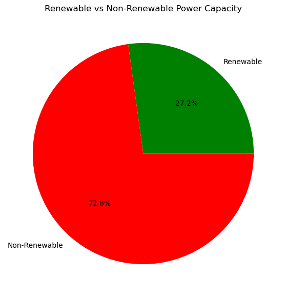

# GlobalPlantsDataset

This repository focuses on analyzing and visualizing global power plant data, along with relevant socio-economic and policy factors that influence the energy landscape.

---

## Week 2 Progress

### Literature Review
- **Created and uploaded** a Literature Review that explores *multi-country* research on energy consumption, emissions, and economic trends.
- Emphasized how **policy instruments** (e.g., carbon pricing, renewable incentives) shape national-level energy outcomes across various countries.
- Highlighted **key methodologies** such as panel data approaches, co-integration, and difference-in-differences for policy impact evaluation.

### Data Alignment
- **Refined dataset selection** to integrate:
  1. IEA time-series data  
  2. World Bank’s World Development Indicators (WDI)  
  3. The Global Power Plant Database
- **Outlined steps** to incorporate both *quantitative* (e.g., subsidy levels) and *qualitative* (e.g., policy start dates) information into the analysis.

Stay tuned for **data cleaning**, **exploratory analysis**, and initial **modeling** phases, building on insights from the literature review.

---
## Week 4 Progress

### Overview
This week, I completed the **initial data collection** and **exploratory data analysis (EDA)** steps:
- Merged power plant data with socio-economic indicators (World Bank).
- Calculated total renewables vs. fossil capacities.
- Examined time-series trends for GDP, emissions, and energy use across top countries.

### Key Achievements
- **Cleaned & Merged**: Created a consolidated `country_capacity` table indicating renewable_ratio for ~167 countries.
- **EDA Visualizations**:
  1. **Bar Charts** for top 10 countries by power plant count, plus total capacity by fuel source.
  

         
         
     

  2. **Pie Chart** showing global renewable vs. non-renewable share.
  

         
     

  
  3. **Line Plots** demonstrating GDP trends over time between fuel majority countries and green energy countries.
  

         
         
     

  4. **Choropleth Map**  Indicating “Green Majority” vs. “Fuel Majority” countries.
  

         
     

### Next Steps
- **Enhanced Correlation Analysis**: Investigate relationships between GDP, CO₂, and renewable share with regression or correlation tests.
- **Improve Mapping**: Possibly create an animated map over different years if consistent time-series coverage is found.

### Additional Notes
- **File Sizes**: The final merged dataset remains manageable (~under 100 MB), so it can be stored locally and visualized with Python libraries.
- **Repository**: All `.ipynb` notebooks for EDA and final `.csv` merges are pushed to GitHub for version control.
---

## Weekly Report 5

### Overview
This week, the main objective was to perform a **multi-variable analysis** on the 2005 data, focusing on **“Energy use (kg of oil equivalent per capita)”**. Originally, 2019 yielded no valid rows (all “..”), so the final approach targeted **2005**—which contained 218 non-missing rows in the `world_bank` table. 

### Key Steps & Code

1. **Identify Year with Data**  
   - Queried the `world_bank` table to check how many rows were not “..” for each year.  
   - Discovered that **2005** (among others) had over 200 rows of actual numeric data for “Energy use.”

2. **Ephemeral SQL Merge**  
   - Used a **LEFT JOIN** between `country_capacity` (which includes total_renewable_capacity & total_capacity) and the `world_bank` data for the chosen year (`2005 [YR2005]`).  
   - Created a new column, `renewable_ratio = total_renewable_capacity / total_capacity`.  
   - Excluded columns that were mostly missing (like `pop_2005`) to avoid dropping too many rows.

3. **Correlation & Single-Variable OLS**  
   - After dropping rows with missing data, ran a **Pearson correlation** between `renewable_ratio` and `energy_2005`.  
   - Found a **negative** correlation (\(r \approx -0.2127\), \(p \approx 0.0168\)), suggesting countries with higher renewable share tend to have lower “energy use” in 2005.  
   - A simple OLS regression of `energy_2005 ~ renewable_ratio` showed a **significant negative slope** (\(-2007\)), but a low R² (~0.045), indicating renewable ratio alone explains little of the variation.

4. **Multiple Regression: Adding GDP**  
   - Queried the “GDP (current US$)” for 2005 in the same ephemeral join.  
   - Built a model: `energy_2005 ~ renewable_ratio + gdp_2005`.  
   - The negative coefficient on `renewable_ratio` remained significant (\(p\approx0.02\)), while GDP’s coefficient was not significant (\(p\approx0.16\)).  
   - The model’s R² rose slightly to ~0.06, so including GDP does not drastically improve explanatory power.

5. **Visualization**  
   - A **scatterplot** and **pairplot** confirm a wide spread of data with a slight negative slope for `renewable_ratio` vs. `energy_2005`.  
   - **Partial regression plots** (via `plot_partregress_grid`) illustrate the relationship between `renewable_ratio` and energy use controlling for GDP.

### Interpretations & Observations
- **Statistically Significant** Negative Relationship: Countries with higher renewable ratio still display *somewhat* lower per-capita energy use in 2005, even controlling for GDP.  
- **GDP Not Overwhelmingly Predictive**: The GDP coefficient in the two-variable model was not significant (\(p\approx0.16\)), suggesting GDP alone does not capture major variations in energy use— or potential issues with data alignment or coverage.  
- **Low R²**: Both single-variable and multi-variable R² values remain under ~0.07, highlighting that **many other factors** likely influence energy use (climate, industrial sector mix, region, etc.).

### Next Steps
1. **Add More Controls**: Incorporate further variables (e.g., “Fossil fuel energy consumption,” “Carbon intensity,” or region dummies) to see if the negative effect of renewables persists or becomes stronger.  
2. **Time-Series or Panel Analysis**: Analyze multiple years (1970–2005, for instance) to track whether increasing renewables over time correlates with lowered energy use or emissions.  
3. **Policy Indicators**: If available, incorporate data from `oecd_greengrowth` or other environmental policy metrics to see if policy intensity moderates the relationship.  
4. **Address Data Gaps**: Explore why certain columns (like population) are missing and consider alternative data sources or partial merges.

By systematically adding variables and looking at multiple years/policies, we can build a more robust model and gather deeper insights for the final project.

---
### Midterm Progress:
For my midterm project, I integrated and analyzed global power plant data alongside socioeconomic, emissions, and policy indicators to study energy use and the energy mix across countries. I merged datasets from sources like the Global Power Plant Database, World Bank, IEA, and OECD, and performed comprehensive exploratory data analysis to uncover key trends. Initial simple regressions and advanced panel data models—using both Fixed and Random Effects—revealed important differences between within-country changes and cross-country comparisons. The Hausman test indicated that time-invariant factors play a significant role, guiding my next steps to incorporate CO₂ emissions data and refine the models further. This progress lays a solid foundation for understanding the impact of renewable energy and green policies on emissions and energy use.